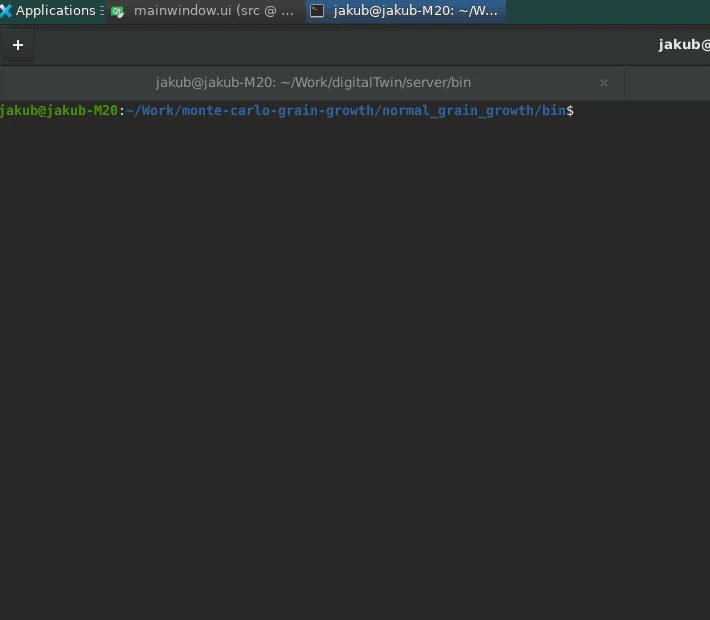

# Normal grain growth

This code is written in C++. It represents a minimalistic example of Potts Monte Carlo methods to simulation the normal grain growth. Visualization is written using VTK libraries. 

## Build
Required packages to be preinstalled:
- VTK 8.2
- cmake 3.5.1 or higher

In the code's directory create `build directory` and enter it. Build the code using `cmake`.

```
mkdir build && cd build 
cmake ..
```

## Compile
The build will create a `Makefile`:

```
make
```

The executable file named `a.out` will be stored in `../bin` directory.

## Run
```
./a.out
```

or 
```
MESA_GL_VERSION_OVERRIDE=3.2 ./a.out
```



The code will run the monte-carlo simulation. The results will be plotted in the window and saved as screenshots in `../screenshots` directory.

> The user will not be able to interact with the plot because all runs on a single thread. 
